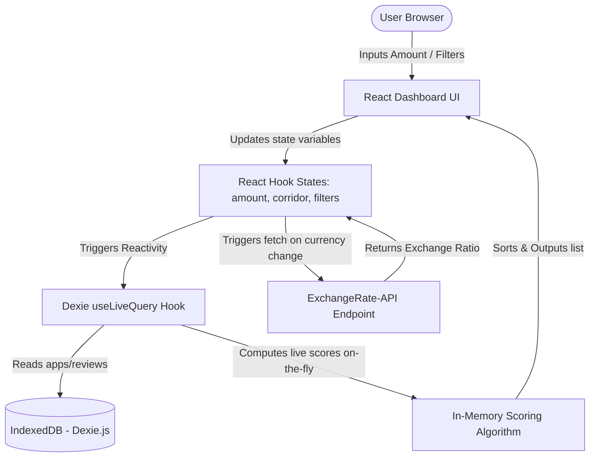

# PayPick Technical Architecture Design

This document details the system design, reactive state flow, database architecture, and external integration mechanisms of the PayPick recommender application.

---

## High-Level System Architecture

PayPick is designed as a serverless, **Frontend-Only Single Page Application (SPA)** that runs entirely inside the user's web browser. It utilizes IndexedDB for local data persistence, eliminating the need for a database server while maintaining persistence across browser reloads.



---

## 1. Database Schema (Dexie.js)

The application uses **Dexie.js** as a developer-friendly wrapper over IndexedDB.

### Database: `PaymentAppDB`

#### Table: `apps`
Stores the metadata, default fee tiers, and capability flags of the supported payment systems.
- **Primary Index**: `id`
- **Indices**: `country`, `cached_score`
- **Record Model**:
  ```typescript
  interface PaymentApp {
      id: string;
      name: string;
      country: string;
      features: string;
      base_rating: number;
      base_count: number;
      logo_url: string;
      cached_score: number;
      fixed_fee: number;
      percent_fee: number;
      avg_speed_mins: number;
      supported_destinations: string[];
      exchange_rate_markup: number;
      has_nfc: boolean;
      has_qr_code: boolean;
      has_debit_card: boolean;
      has_crypto: boolean;
  }
  ```

#### Table: `reviews`
Stores P2P user-generated ratings and comments.
- **Primary Index**: `++id` (Auto-incrementing integer)
- **Indices**: `app_id`, `timestamp`
- **Record Model**:
  ```typescript
  interface Review {
      id?: number;
      app_id: string;
      rating: number;
      text: string;
      timestamp: number; // UTC Epoch Seconds
  }
  ```

---

## 2. Reactive Dataflow & Calculations

To deliver a lag-free 60fps typing experience in the Transfer Calculator, calculations are computed **in-memory** during Dexie queries.

1. **Keystroke/Selector Change**: The user alters states (`transferAmount`, `destinationCountry`, etc.).
2. **Recompute Query**: The `useLiveQuery` hook in `App.tsx` triggers reactively.
3. **Database Pull**: It reads raw lists from `apps` and `reviews`.
4. **Scoring Compilation**: It maps each app through `calculateScore()`, feeding in current calculator states.
5. **UI Rendering**: The lists are filtered and sorted dynamically before updating the screen.

---

## 3. Real-Time Exchange Rate Fetching

PayPick integrates with the free, public `ExchangeRate-API` to query live rates on demand.

### Corridor Conversion Pipeline
1. Location maps (e.g. `US` ➔ `USD`, `IN` ➔ `INR`) identify the currencies involved.
2. If `Source !== Destination`, a GET request is dispatched to:
   `https://open.er-api.com/v6/latest/{SourceCurrency}`
3. The response rate is stored in React state.
4. The converted payout displayed on each card is computed as:
   $$\text{Recipient Receives} = (\text{TransferAmount} - \text{BaseFee}) \times (\text{LiveRate} \times (1 - \text{Markup}))$$
